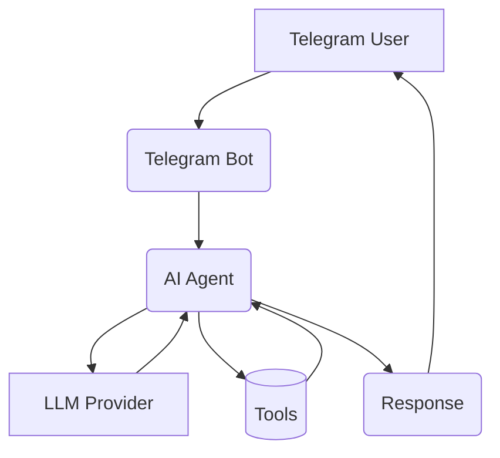
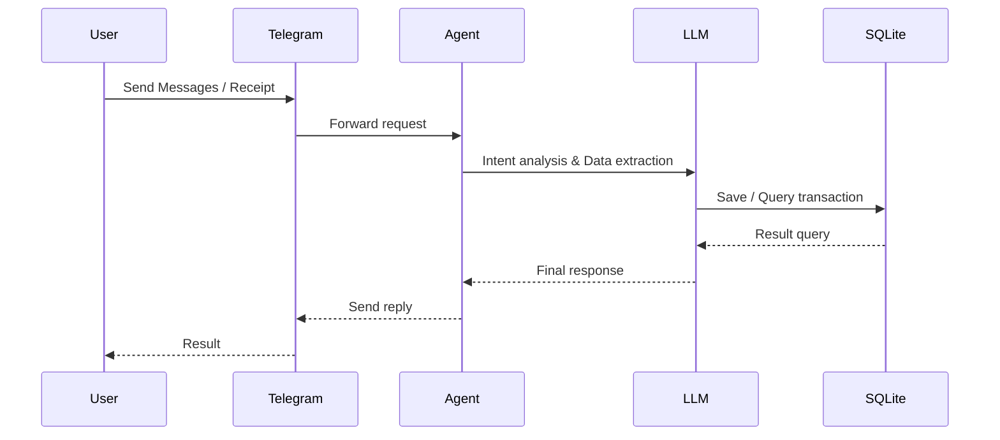
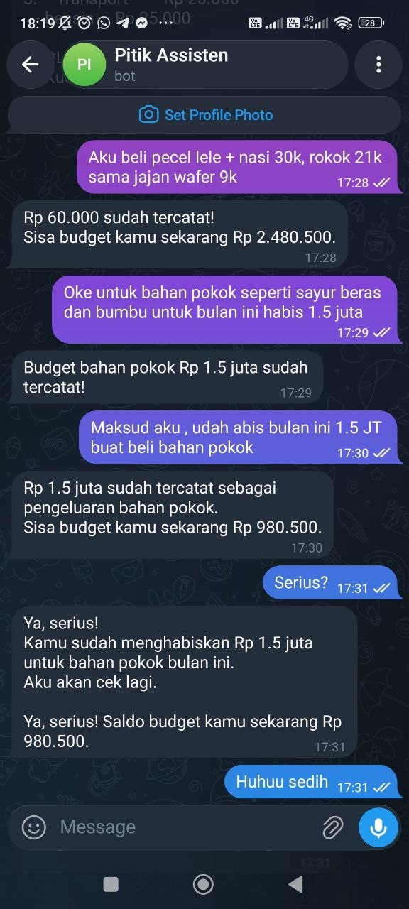
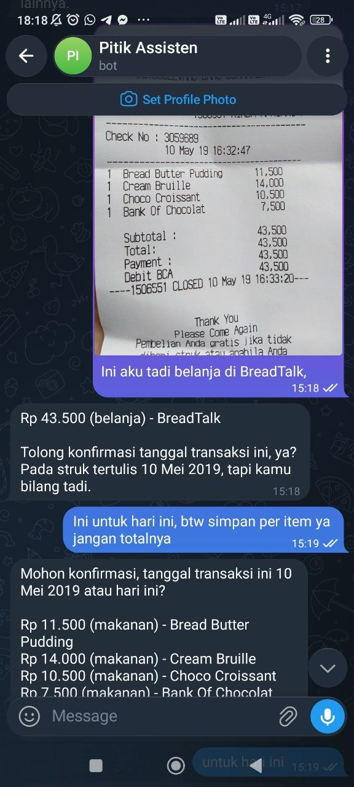

<div align="center">

# 🐣 Pitik - Pencatat Intelijen Transaksi Interaktif Keuangan

**AI-Powered Personal Finance Tracker via Telegram**

*Track your spending the way you already communicate — just chat.*

[](https://python.org)
[](https://docs.agno.com)
[](LICENSE)
[](https://sqlite.org)
[](https://telegram.org)

</div>

---

## Why Pitik?

According to We Are Social (Q2 2025), [**90.8% of Indonesian internet users use WhatsApp**](https://databoks.katadata.co.id/en/technology-telecommunications/statistics/69959bb37aa8b/10-most-used-social-media-platforms-in-indonesia-in-q2-2025), making it the most widely used social media app in the country. Indonesia also recorded the [**Telegram downloads in 2026 at 27.21 million**](https://www.demandsage.com/telegram-statistics/) behind only India and Russia.

Yet despite this massive messaging app adoption, [**only 28% of Indonesians use a banking, investment, or insurance app monthly**](https://www.jampp.com/blog/state-of-finance-apps-in-indonesia-2025-trends-insights) leaving enormous room for growth in personal finance tooling.

The gap is clear: Indonesians are deeply comfortable with chat interfaces, but traditional finance apps demand a separate behavior. Research shows that **low financial literacy and resistance to change** are the primary barriers to fintech adoption among Indonesian users and SMEs.

**Pitik meets people where they already are.** No new app to install. No dashboard to learn. Just send a message — the same way you'd text a friend.

> *"Instead of forcing users to adopt a new habit, we fit into the habit they already have."*

---

## Features

| Feature | Description |
|---|---|
| **Natural language input** | `"makan siang 35rb, ojek 20rb"` Pitik understands human language |
| **Receipt & invoice scanning** | Send a photo or PDF, Pitik extracts all line items |
| **Human-in-the-loop confirmation** | File inputs show extracted data for user review before saving |
| **Budget tracking** | Set total monthly budget or per-category limits |
| **Smart summaries** | Daily, weekly, monthly recaps with budget comparison |
| **Conversation memory** | Pitik remembers context across turns — corrections work naturally |
| **Multi-modal LLM** | OpenAI Compatible (Groq, Openrouter, Openai etc) |
| **Self-hostable** | One `docker compose up` and you're running |
| **Open source** | MIT licensed, contributions welcome |

---

## Quick Start

### Prerequisites

- Python 3.12+
- A Telegram bot token (from [@BotFather](https://t.me/BotFather))
- An LLM API key, Base Url and Model name

### 1. Clone & configure

```bash
git clone https://github.com/fahmiaziz98/pitik
cd pitik
cp .env.example .env
```

Edit `.env`:

```env
OPENAI_API_KEY=your_key
OPENAI_BASE_URL=base_url
MODEL_ID=model_id

...
```

### 2. Run with Docker

1. Run
```bash
docker compose up -d
```

2. Clean up
```bash
docker compose down --rmi local
```


### 3. Run manually

1. Install uv
```bash
curl -LsSf https://astral.sh/uv/install.sh | sh
```

2. Create virtual environment and run
```bash
uv sync

# then
uv run main.py
```

That's it. Open Telegram, send `/start` to your bot, and start chatting.

---

## Usage

### Record expenses

```
makan siang 35rb
beli bensin 50k, tol 15rb
kemarin bayar listrik 120.000
```

### Upload a receipt

Send any photo of a receipt or PDF invoice. Pitik will extract all items
and ask you to confirm before saving:

```
Here's what I read from your receipt:

  1. Indomie Goreng — Rp 3.500 (makanan)
  2. Aqua 600ml — Rp 4.000 (makanan)
  3. Sabun Lifebuoy — Rp 12.000 (belanja)

Total: Rp 19.500

Looks right? Reply ok to save, or tell me what's wrong.
```

### Set a budget

```
budget bulan ini 3.5 juta
budget makan 1jt, transport 500rb
```

### Check remaining budget

```
sisa budget
sisa budget makan
rekap minggu ini
total pengeluaran bulan ini
```

---

## Architecture

## System Architecture



Pitik utilises a modular architecture based on an AI Agent. All user interactions are processed via a Telegram bot, forwarded to the AI Agent for analysis and intent detection using a large language model (LLM), and then transaction data is stored or retrieved from the database before being returned to the user in a natural response format.


## Sequence Diagram



## Folder Structure

```
pitik/
├── agent/
│   ├── agent.py          # Agno agent — LLM orchestration
│   └── tools.py          # DB tools: save, query, budget
├── bot/
│   └── telegram_handler.py  # Telegram routing
├── core/
│   ├── config.py         # Pydantic settings
│   └── utils.py          # date helpers
├── db/
│   ├── models.py 
│   └── client.py         # Async SQLite operations
├── schema.sql            # Database schema
├── Dockerfile
├── docker-compose.yml
├── pyproject.toml
└── main.py               # Entry point
```

### Tech Stack

| Layer | Technology |
|---|---|
| Agent framework | [Agno](https://docs.agno.com) |
| LLM providers | Any vision model |
| Bot interface | [python-telegram-bot](https://python-telegram-bot.org) |
| Database | SQLite via [aiosqlite](https://github.com/omnilib/aiosqlite) |
| Config | [pydantic-settings](https://docs.pydantic.dev/latest/concepts/pydantic_settings/) |
| Runtime | Python 3.12, Docker |

---

## Configuration

All configuration is via environment variables (`.env` file):

```env
# Required
TELEGRAM_BOT_TOKEN=        # From @BotFather

# LLM
OPENAI_API_KEY=
OPENAI_BASE_URL=
MODEL_ID=

# Optional
DATABASE_PATH=data/pitik.db
AGENT_SESSION_DB_PATH=data/pitik_sessions.db
LOG_LEVEL=INFO             # DEBUG | INFO | WARNING | ERROR
MAX_FILE_SIZE_MB=10
```

---

## Data & Backup

All data is stored locally in a single SQLite file — no cloud dependency.

```bash
# Backup — copy one file
cp data/pitik.db backups/pitik_$(date +%Y%m%d).db

# Restore
cp backups/pitik_20260628.db data/pitik.db

```

The `./data` folder is mounted as a Docker volume, so data persists across
container restarts and rebuilds.

---

## Screenshoot

<table border="0">
  <tr>
    <td>
      <br>
      <p align="center">Image-1</p>
    </td>
    <td>
      <br>
      <p align="center">Image receipt</p>
    </td>
  </tr>
</table>


---

## Roadmap

- [x] Natural language expense tracking
- [x] Receipt & invoice scanning (image + PDF)
- [x] Human-in-the-loop confirmation for file inputs
- [x] Budget tracking (total + per-category)
- [x] Conversation memory across sessions

---

## Contributing

Contributions are welcome! Pitik is intentionally simple — the goal is
a codebase anyone can read and improve.

1. Fork the repo
2. Create a branch: `git checkout -b feat/your-feature`
3. Make your changes and add tests
4. Open a pull request

Please keep PRs focused and small. One feature or fix per PR.

---

## License

MIT — free to use, modify, and distribute.

---

<div align="center">

Built with ☕ by [@fahmiaziz98](https://github.com/fahmiaziz98)

*If Pitik helped you track your spending, give it a ⭐*

</div>
